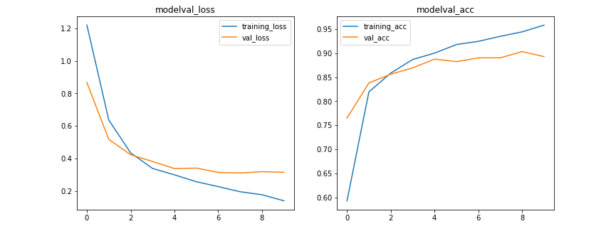

# TFLite Android Flowers Classfication
五種花朵辨識。Transfer Learning using Mobilenet。

- training(3440)

## Flowers
 | daisy  | dandelion  |  rose | selma bouvier  |  sunflower |  tulip |
|---|---|---|---|---|---|
|   |   |   |   |  |

## Mobilenet
Transfer learning and fine-tuning.

- Input size: 224*224
- mode: tf ( will scale pixels between -1 and 1 ) 除以127.5，然後減 1。

## Reference
- [圖片預處理使用Keras applications 的 preprocess_input](https://medium.com/@sci218mike/%E5%9C%96%E7%89%87%E9%A0%90%E8%99%95%E7%90%86%E4%BD%BF%E7%94%A8keras-applications-%E7%9A%84-preprocess-input-6ef0963a483e)
- [tf.keras.applications.resnet50.preprocess_input](https://www.tensorflow.org/api_docs/python/tf/keras/applications/resnet50/preprocess_input)
- [GitHub Keras preprocess_input](https://github.com/keras-team/keras/blob/v2.6.0/keras/applications/imagenet_utils.py)